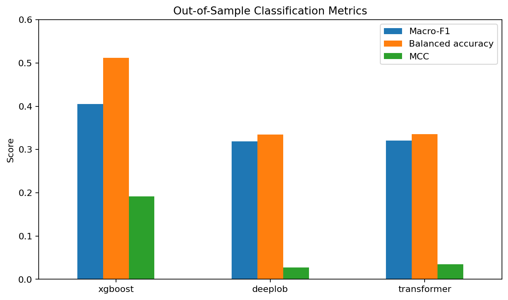
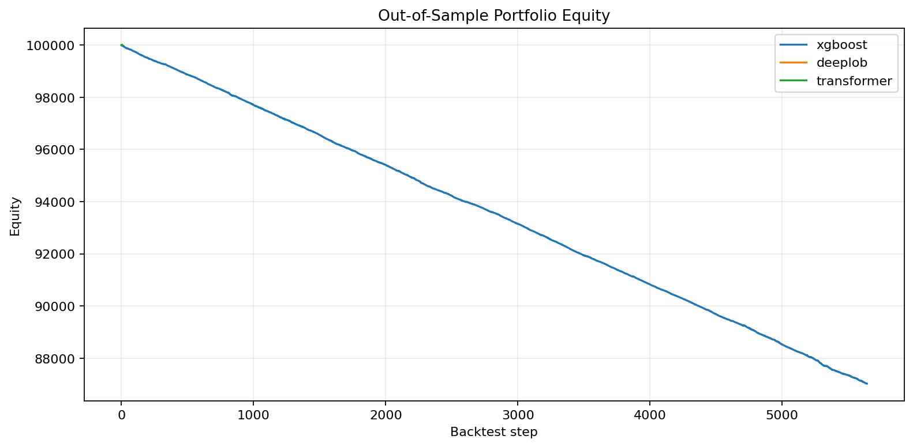

# Cost-Aware Limit Order Book Forecasting

Short-horizon BTCUSDT limit-order-book forecasting with **XGBoost, DeepLOB, and a compact Transformer**, evaluated with executable bid/ask prices and transaction costs.

The project asks a simple question:

> Do better classification metrics on limit-order-book data translate into better executable trading performance after spread, fees, and slippage?

The answer in this experiment was **no**. XGBoost was materially better at detecting minority directional classes, but its signals lost money after execution costs. DeepLOB and the Transformer achieved high raw accuracy largely by predicting the dominant no-trade class.



## Final results

The final experiment used roughly 3.7M BTCUSDT perpetual LOB snapshots sampled at about 250 ms, ten book levels, 100-snapshot input windows (~25 s), and a 40-snapshot forecast horizon (~10 s). The out-of-sample test set contained 605,175 labeled events and was strongly imbalanced: 4.42% short/down, 90.57% flat, and 5.01% long/up.

| Model | Accuracy | Macro-F1 | Balanced accuracy | MCC | Net P&L | Return | Trades |
| --- | ---: | ---: | ---: | ---: | ---: | ---: | ---: |
| XGBoost | 0.708 | **0.405** | **0.512** | **0.192** | -$12,978.51 | -12.98% | 5,642 |
| DeepLOB | 0.906 | 0.319 | 0.334 | 0.028 | $0.00 | 0.00% | 0 |
| Transformer | 0.906 | 0.320 | 0.335 | 0.035 | +$7.44 | +0.007% | 6 |

The Transformer result is **not evidence of profitability**: only six trades passed the fixed 0.50 confidence threshold. DeepLOB placed no trades. XGBoost produced many more directional signals, but its minority-class precision was only about 12–13%, and transaction costs overwhelmed the predictive edge.



Detailed metrics and run configurations are committed under [`results/`](results/).

## Why accuracy is misleading here

The test set is about 90.6% flat. A model that almost always predicts flat can therefore report ~90% accuracy while having little directional value.

DeepLOB and the Transformer illustrate this failure mode:

- DeepLOB balanced accuracy: **0.334**
- Transformer balanced accuracy: **0.335**
- Three-class chance-level balanced accuracy: approximately **0.333**

XGBoost reduced raw accuracy but improved balanced accuracy to **0.512** and MCC to **0.192**, showing substantially better directional discrimination. The backtest then shows the second half of the research question: classification improvement alone was not enough to overcome trading costs.

## Experiment design

### Input

Each snapshot contains ten LOB levels. Internally the 40 raw features are represented as:

```text
[ask_price_1, ask_size_1, bid_price_1, bid_size_1, ... level 10]
```

A model receives 100 consecutive snapshots:

```text
X_t in R^(100 x 40)
```

### Cost-aware target

Instead of labeling only future mid-price direction, the primary target uses executable entry and exit prices.

For a long action:

```text
buy now at current ask -> sell at future bid
```

For a short action:

```text
sell now at current bid -> buy back at future ask
```

The target assigns `short`, `flat`, or `long` after accounting for a 1.0 bp fee per side and 0.5 bp slippage per side. Spread is naturally represented by using ask prices for buys and bid prices for sells.

### Split

The real-data experiment is chronological:

- first 8 days: training
- next 2 days: validation
- final 2 days: test

No random train/test shuffle is used. Sequence/forecast boundaries are handled by the data pipeline to avoid leakage across windows.

### Models

- **XGBoost** — engineered microstructure features plus window summaries; trained on the full training split with class-balanced sample weights.
- **DeepLOB** — convolutional feature extraction, inception block, and LSTM; trained on 1,000,000 representative windows for five epochs.
- **Transformer** — compact 2-layer, 4-head encoder with `d_model=64`; trained on 500,000 representative windows for five epochs.

The neural subsampling was a compute choice; adjacent 100-snapshot windows overlap heavily. All models were evaluated on the full test period.

## Backtest assumptions

The portfolio backtest is deliberately simple and transparent:

- one open position maximum;
- fixed 40-snapshot holding horizon;
- fixed $10,000 notional per trade;
- $100,000 initial equity;
- immediate full fill at top of book;
- 1.0 bp fee per side;
- 0.5 bp slippage per side;
- fixed 0.50 model-confidence threshold;
- no queue-position model, partial fills, market impact, or funding;
- equity/drawdown updated at trade exits.

This is an **evaluation backtest**, not a production execution simulator.

## Repository structure

```text
configs/                 Data/model configuration examples
data/sample/             Small synthetic fixture for pipeline checks
docs/                    Real-data and backtest documentation
notebooks/               EDA, modeling, backtesting, and Kaggle run notebooks
results/                 Lightweight final metrics and figures
scripts/                 Reproducible CLI entry points
src/lob_project/         Reusable Python package
tests/                    Unit tests
```

Raw BTC data, processed arrays, predictions, and trained checkpoints are intentionally not committed.

## Installation

The project uses Python 3.12 and [`uv`](https://docs.astral.sh/uv/).

```bash
uv sync
```

Notebook dependencies are optional:

```bash
uv sync --extra notebooks
```

Run the tests:

```bash
uv run pytest -q
```

The published repository contains a small synthetic fixture, so core pipeline tests do not require the multi-gigabyte BTC dataset.

## Quick synthetic smoke test

Synthetic data is included only to verify code paths. It is **not** financial evidence.

```bash
uv run python scripts/prepare_data.py \
  --input data/sample/synthetic_fi2010.txt \
  --output-dir data/processed/synthetic_h50 \
  --horizon 50 \
  --sequence-length 100 \
  --normalize train \
  --executable-prices

uv run python scripts/train_model.py \
  --model baseline \
  --processed-dir data/processed/synthetic_h50 \
  --output-dir outputs/baseline_h50

uv run python scripts/evaluate_model.py \
  --run-dir outputs/baseline_h50 \
  --processed-dir data/processed/synthetic_h50
```

## Reproducing the BTC experiment

### 1. Obtain the data

The final experiment used the public Kaggle dataset **Bitcoin Limit Order Book (LOB) Data**:

https://www.kaggle.com/datasets/siavashraz/bitcoin-perpetualbtcusdtp-limit-order-book-data

The repository does not redistribute the source dataset. Place the downloaded CSV/CSV.GZ under `data/raw/`.

### 2. Prepare the h=40 cost-aware dataset

For the full multi-million-row CSV, use the low-memory preparer rather than the original in-memory path:

```bash
uv run python scripts/prepare_btc_lob_low_memory.py \
  --input data/raw/YOUR_BTC_FILE.csv \
  --column-map configs/btc_kaggle_numeric_columns.json \
  --output-dir data/processed/btc_h40_cost \
  --chunksize 100000 \
  --sequence-length 100 \
  --horizon 40 \
  --label-type cost-aware \
  --fee-bps 1.0 \
  --slippage-bps 0.5 \
  --minimum-edge-bps 0.0 \
  --train-days 8 \
  --validation-days 2
```

### 3. Train the final models

XGBoost:

```bash
uv run python scripts/train_model.py \
  --model xgboost \
  --processed-dir data/processed/btc_h40_cost \
  --output-dir outputs/btc_h40_cost/xgboost
```

DeepLOB:

```bash
uv run python scripts/train_model.py \
  --model deeplob \
  --processed-dir data/processed/btc_h40_cost \
  --output-dir outputs/btc_h40_cost/deeplob \
  --max-train-samples 1000000 \
  --epochs 5 \
  --batch-size 512
```

Transformer:

```bash
uv run python scripts/train_model.py \
  --model transformer \
  --processed-dir data/processed/btc_h40_cost \
  --output-dir outputs/btc_h40_cost/transformer \
  --max-train-samples 500000 \
  --epochs 5 \
  --batch-size 512
```

GPU training is recommended for the neural models. The final runs used CUDA on Kaggle.

### 4. Evaluate and backtest

For each model:

```bash
uv run python scripts/evaluate_model.py \
  --run-dir outputs/btc_h40_cost/MODEL \
  --processed-dir data/processed/btc_h40_cost

uv run python scripts/run_portfolio_backtest.py \
  --run-dir outputs/btc_h40_cost/MODEL \
  --processed-dir data/processed/btc_h40_cost \
  --confidence 0.50 \
  --initial-equity 100000 \
  --notional-per-trade 10000 \
  --fee-bps 1.0 \
  --slippage-bps 0.5
```

Replace `MODEL` with `xgboost`, `deeplob`, or `transformer`.

For the exact Kaggle workflow used for the final neural runs, see [`notebooks/08_kaggle_final_run.ipynb`](notebooks/08_kaggle_final_run.ipynb).

## Limitations

The final results should be interpreted as a controlled research experiment, not as evidence of a deployable trading strategy.

- Only one short BTCUSDT market period is evaluated.
- The final reported table uses one chronological train/validation/test split rather than a full walk-forward aggregate.
- Neural models were trained on representative subsets due to compute constraints.
- The neural training loss is not class-weighted in this frozen project version, which helps explain majority-class collapse.
- Backtesting assumes immediate top-of-book fills and ignores queue position, partial fills, market impact, and perpetual funding.
- The confidence threshold was fixed at 0.50 for comparability rather than optimized for P&L.

These limitations are intentional: the project focuses on the gap between **forecast metrics** and **executable economic performance**.

## References

- Zhang, Zohren & Roberts, *DeepLOB: Deep Convolutional Neural Networks for Limit Order Books*, IEEE Transactions on Signal Processing / arXiv: https://arxiv.org/abs/1808.03668
- Public BTCUSDT LOB dataset: https://www.kaggle.com/datasets/siavashraz/bitcoin-perpetualbtcusdtp-limit-order-book-data

## License

Code in this repository is released under the MIT License. The external datasets retain their own licenses and are not redistributed here.
